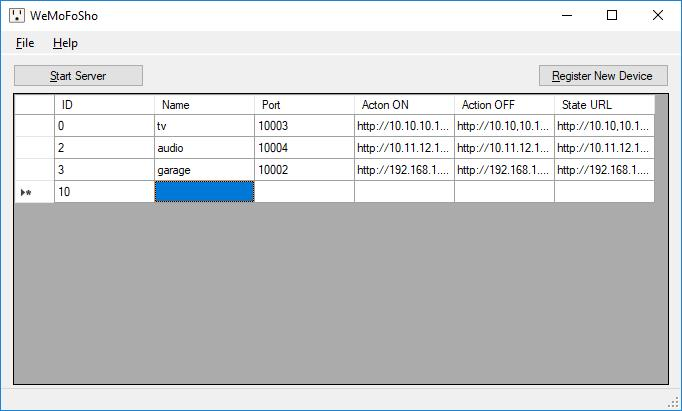
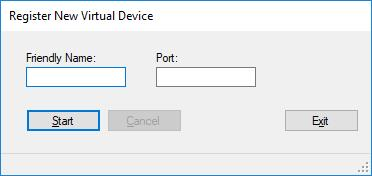

# WeMoFoSho

**This app will spoof several WeMo devices.**   

It allows the computer to respond to Amazon Echo as if it were several different WeMo devices.

To do this, it does 2 things:  
1. creates web servers for virtual devices you specify  
2. creates a UDP server to listen for the UPnP scans from the Echo  

 
 
 

**To register a new virtual device:**  
  
 1. enter a new entry into the table - each entry will be a web server
  * name (aka Friendly Name - remember for step 2)
  * unique port # for a new web server
  * Action ON - a URL that triggers ON for something OR a command to run
  * Action OFF - a URL that triggers OFF for something OR a command to run
 2. select the "Register New Device" button.  A new dialog will pop up.
  * Enter the same name & port you put in the table on step one
  * Click Start.  This will cause the app to listen on UDP port 1900 for UPnP requests from the Echo.
  * Say "Alexa, Discover devices"
  * The app should respond to the Echo pretending it is a WeMo device with that name specified.
  * repeat for each virtual WeMo you create in the table.  Once the devices are registered, you won't need to do that part again.
  * Click Exit
 3. Back on the main form, click Start Server.  This should start each web server.
 4. Test by saying "Alexa, turn ON <your device name>" and "Alexa, turn OFF <your device name>"
  
  
**Notes:**
 * You can right-click the tray icon to set run at startup.  
 * If User Account Control is turned on, the app will prompt to run as administrator.  
 * You may need to adjust Windows Firewall to allow the UDP server  
 * Make sure to File-->Save!  
 * You may have to disable IPv6 for the UDP stuff to work!

